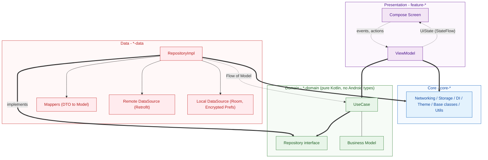
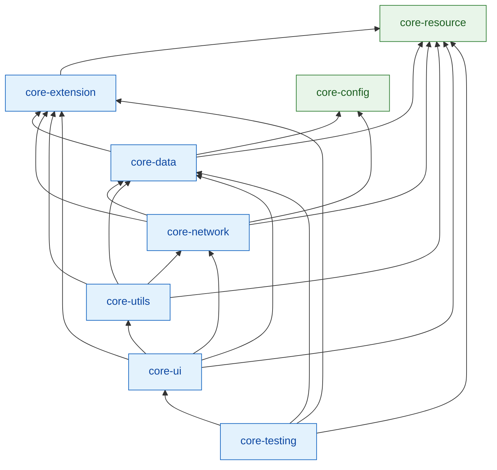
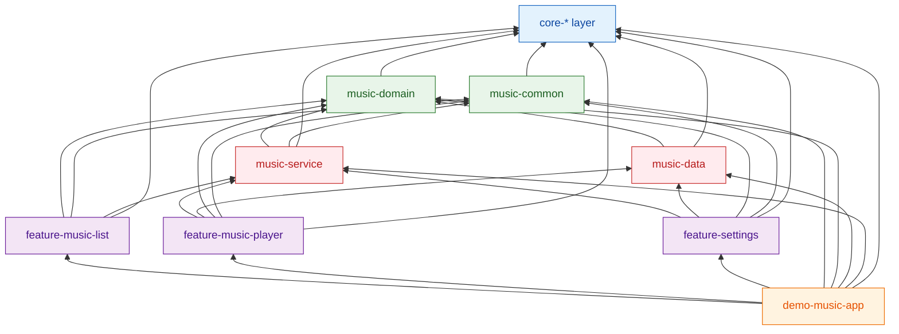
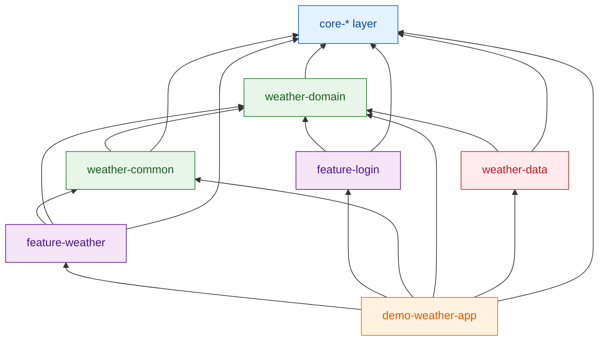

<h1 align="center">Android Compose Architecture</h1>

<p align="center">
  A production-grade, multi-module Android blueprint built with Jetpack Compose, Clean Architecture and Gradle convention plugins.
</p>

<p align="center">
  
  
  
  
  
  
  
  
</p>

---

## Table of Contents

- [About the Project](#about-the-project)
- [Demo Applications](#demo-applications)
- [Architecture](#architecture)
- [Modularization Strategy](#modularization-strategy)
- [Module Dependency Graph](#module-dependency-graph)
- [Build Logic & Convention Plugins](#build-logic--convention-plugins)
- [Build Variants & Environment Configuration](#build-variants--environment-configuration)
- [Tech Stack](#tech-stack)
- [Getting Started](#getting-started)
- [Building & Running](#building--running)
- [Testing](#testing)
- [Code Style](#code-style)
- [Project Conventions](#project-conventions)
- [Roadmap](#roadmap)
- [Contributing](#contributing)
- [License](#license)

---

## About the Project

**Android Compose Architecture** is a reusable code base and reference implementation for building modern, high-performance Android applications. Rather than being a single app, it is a **platform**: a set of hardened `core-*` modules, shared build logic and architectural guidelines that multiple product apps can be assembled from.

It is designed for **complex, long-lifecycle projects** where scalability, build speed, testability and team parallelism matter:

- **Clean Architecture** boundaries - UI, domain and data are physically separated by Gradle modules, not just packages.
- **Feature-first modularization** - each feature is an independently compilable, independently testable unit.
- **Composable core layer** - networking, storage, DI, theming, resources and utilities are shared across all apps.
- **Centralized build logic** - Gradle convention plugins remove boilerplate from every `build.gradle.kts`.
- **Multiple demo apps in one repo** - proving that the core layer is not tied to any single app.

## Demo Applications

Two full applications are built on top of the same core layer, each demonstrating a different problem domain.

| App | Modules | What it demonstrates |
| --- | --- | --- |
| 🎵 **Demo Music** | `demo-music/*` | Media3 / ExoPlayer playback, foreground `MediaLibraryService`, media notifications, browsable media tree, saved playlists with Room, Compose navigation |
| ⛅ **Demo Weather** | `demo-weather/*` | Runtime location permissions, Play Services location, REST integration with Retrofit, local caching with Room, tabbed Compose UI (now / hourly / daily), login flow |

## Architecture

The project follows **Clean Architecture** with a unidirectional data flow and an MVVM presentation layer.



**How to read it** - thick arrows (`==>`) are **compile-time dependencies**, dotted arrows are **runtime data flow**. Note that `RepositoryImpl` points *upward* to the `Repository interface` it implements: the Data layer depends on Domain, never the reverse. That inversion is what keeps `*-domain` free of Retrofit, Room and Android types.

**Key principles**

- **Dependency rule** - dependencies point inwards. Features depend on domain abstractions; only the `*-data` module knows about Retrofit, Room or the preference store.
- **Single source of truth** - repositories expose `Flow` streams; the network is treated as a cache-filling side effect, not as the UI's data source.
- **State-driven UI** - `BaseViewModel` exposes a `SharedFlow<ViewModelState>` (`Idle` / `Loading(ProgressType)` / `Error`) so that loading indicators and API error handling are implemented once and reused everywhere.
- **Centralized error handling** - `ApiErrorHandler` is injected into `BaseViewModel`; each app supplies its own `ApiErrorHandlerImpl`.
- **Interface at the boundary, implementation at the edge** - `SessionManager`, `TokenRefresher`, `NetworkConfig`, `BuildConfig` and `InAppUpdateManager` are declared in core modules and implemented per app, keeping core modules free of app-specific knowledge.

## Modularization Strategy

Modules are split along two axes: **layer** (core / domain / data / feature) and **product** (music / weather).

```
android-compose-architecture
├── build-logic/              # Included build: Gradle convention plugins
│   ├── convention/           # ApplicationConventionPlugin, LibraryConventionPlugin, Hilt, Room
│   ├── env-config/           # Shared dev/stg/prod properties
│   └── keystore/             # Signing material
│
├── core-config/              # BuildConfig abstraction (env-independent access to build values)
├── core-data/                # BaseUseCase, BaseDao, storage (encrypted prefs), managers
├── core-extension/           # Kotlin & Android extension functions
├── core-network/             # Retrofit/OkHttp setup, interceptors, authenticator, Remote Config
├── core-resource/            # Shared drawables, strings, dimensions
├── core-testing/             # Test rules, dispatchers and shared fakes (currently unwired - see Testing)
├── core-ui/                  # BaseComposeActivity, BaseViewModel, Material3 theme, permissions
├── core-utils/               # Framework-agnostic helpers
│
├── demo-music/
│   ├── demo-music-app/       # Application module: DI wiring, MainActivity, nav host
│   ├── feature-music-list/   # Browse & search media tree
│   ├── feature-music-player/ # Now playing, playlist, seek bar
│   ├── feature-settings/     # Settings tiles & dialogs
│   ├── music-common/         # UI models & widgets shared across music features
│   ├── music-domain/         # Use cases, models, repository contracts
│   ├── music-data/           # Repositories, Room database, Retrofit API, mappers
│   └── music-service/        # Media3 playback service, browser, notifications
│
└── demo-weather/
    ├── demo-weather-app/     # Application module
    ├── feature-login/        # Login route & view model
    ├── feature-weather/      # Now / hourly / daily / location-history screens
    ├── weather-common/       # Shared UI models
    ├── weather-domain/       # Use cases, models, repository contracts
    └── weather-data/         # Repositories, Room database, Retrofit API, transformers
```

**Rules of engagement**

| Module type | May depend on | Must never depend on |
| --- | --- | --- |
| `core-*` | Other `core-*` modules | Any feature or product module |
| `*-domain` | Pure Kotlin + `core-data` abstractions | Android UI, Retrofit, Room |
| `*-data` | `*-domain`, `core-network`, `core-data` | Any `feature-*` module |
| `feature-*` | `*-domain`, `*-common`, `core-*` | Another `feature-*` module |
| `*-app` | Everything (composition root) | - |

Cross-feature navigation is done through **route contracts** (e.g. `MediaListNavigation`, `WeatherRoute`, `Routes`) exposed by the feature or common module, so features stay mutually independent and the app module owns the navigation graph.

Type-safe project accessors are enabled (`enableFeaturePreview("TYPESAFE_PROJECT_ACCESSORS")`), so modules are referenced as `implementation(projects.coreUi)` instead of fragile string paths.

**No `feature-*` module depends on another `feature-*` module.** Where one feature's UI must appear inside another's (e.g. the Settings page inside the media pager), the host feature exposes a **composable slot** and the app module - the composition root that already knows every feature - supplies the content:

```kotlin
// feature-music-list: declares the hole, knows nothing about who fills it
@Composable
fun MediaListPagerScreen(context: BaseContext, settingsPage: @Composable () -> Unit)

// demo-music-app: the only module allowed to wire features together
MediaListPagerScreen(
    context = context,
    settingsPage = { SettingsScreen(context) },
)
```

## Module Dependency Graph

Generated from the `implementation(projects.*)` declarations across all 22 modules. Arrows point from consumer to dependency.

### Core layer

`core-resource` and `core-config` are leaves with no project dependencies, which keeps the bottom of the graph cheap to rebuild.



### Demo Music



### Demo Weather



Note that `demo-music` and `demo-weather` share the entire `core-*` layer but have **zero** edges between them - either product can be deleted without touching the other.

## Build Logic & Convention Plugins

All shared Gradle configuration lives in the `build-logic` **included build**, exposed as four plugins:

| Plugin ID | Implementation | Responsibility |
| --- | --- | --- |
| `custom.application` | `ApplicationConventionPlugin` | Android application defaults: SDK levels, Compose, desugaring, lint, test options, dependency resolution strategy |
| `custom.library` | `LibraryConventionPlugin` | Android library defaults shared by every `core-*` / feature module |
| `custom.hilt` | `HiltConventionPlugin` | Applies Hilt + KSP and wires the compiler dependencies |
| `custom.room` | `RoomConventionPlugin` | Applies Room, KSP and schema export configuration |

A typical module build file is therefore reduced to a handful of lines:

```kotlin
plugins {
    alias(libs.plugins.custom.library)
    alias(libs.plugins.custom.hilt)
}

android { namespace = "com.andyha.feature.weather" }

dependencies {
    implementation(projects.coreUi)
    implementation(projects.demoWeather.weatherDomain)
}
```

Dependencies are declared once in the **version catalog** (`gradle/libs.versions.toml`) and consumed through **bundles** (`libs.bundles.networking`, `libs.bundles.compose`, `libs.bundles.unitTesting`, …), guaranteeing a single version of every library across all modules.

Build performance is enabled by default in `gradle.properties`: configuration on demand, parallel execution, the Gradle build cache and non-transitive R classes.

## Build Variants & Environment Configuration

**Product flavors** (dimension `env`): `dev`, `staging`, `production`.
Each flavor loads its own `env-config/*.properties` file and injects values (e.g. `baseUrl`) as `buildConfigField`s, so no endpoint is ever hardcoded in Kotlin sources.

**Build types**

| Build type | Minify | Shrink resources | Debuggable | Purpose |
| --- | --- | --- | --- | --- |
| `debug` | ❌ | ❌ | ✅ | Day-to-day development |
| `release` | ✅ | ✅ | ❌ | Store distribution |
| `releaseDebuggable` | ✅ | ✅ | ✅ | Profiling & QA on release-like builds without obfuscation |

`dev` and `staging` flavors use an application ID suffix (`.dev`, `.stg`), so all three environments can be installed side by side on a single device.

## Tech Stack

### In active use

**Language & async**
- [Kotlin](https://kotlinlang.org/) - 100% Kotlin code base
- [Coroutines](https://kotlinlang.org/docs/coroutines-overview.html) & [Flow](https://kotlinlang.org/docs/flow.html) - asynchronous work and reactive streams
- [Kotlin Parcelize](https://developer.android.com/kotlin/parcelize) - boilerplate-free parcelables

**UI**
- [Jetpack Compose](https://developer.android.com/jetpack/compose) (BOM-managed) - declarative UI
- [Material 3](https://m3.material.io/) + window size classes - adaptive, themeable design system
- [Navigation Compose](https://developer.android.com/jetpack/compose/navigation) - per-feature navigation entry points, graph owned by the app module
- [Coil](https://coil-kt.github.io/coil/) - image loading
- [ConstraintLayout Compose](https://developer.android.com/jetpack/compose/layouts/constraintlayout), Compose Animation

**Architecture components**
- [ViewModel](https://developer.android.com/topic/libraries/architecture/viewmodel) & [Lifecycle](https://developer.android.com/topic/libraries/architecture/lifecycle)
- [Room](https://developer.android.com/training/data-storage/room) - local persistence with type converters
- [Encrypted SharedPreferences](https://developer.android.com/topic/security/data) (AndroidX Security Crypto)
- [SQLCipher](https://www.zetetic.net/sqlcipher/) + BouncyCastle - at-rest database encryption, enabled via the `isStorageEncrypted` flag

**Dependency injection**
- [Hilt / Dagger](https://dagger.dev/hilt/) with [KSP](https://kotlinlang.org/docs/ksp-overview.html) and `hilt-navigation-compose`

**Networking**
- [Retrofit](https://square.github.io/retrofit/) + [OkHttp](https://square.github.io/okhttp/) with custom interceptors (host selection, timeout, auth, per-service request headers)
- [Gson](https://github.com/google/gson) converters, token-refreshing `Authenticator`

**Media**
- [Media3 / ExoPlayer](https://developer.android.com/media/media3) - playback, `MediaLibraryService`, media notifications

**Firebase & Play Services**
- Remote Config (feature flags), Crashlytics, In-App Update, Location, Auth

**Quality & tooling**
- [JUnit 4](https://junit.org/junit4/), [MockK](https://mockk.io/), coroutines-test
- [ktlint](https://github.com/JLLeitschuh/ktlint-gradle), Android Lint
- [Timber](https://github.com/JakeWharton/timber) - logging

### Wired in the version catalog, not yet used in code

These are pre-configured as bundles in `gradle/libs.versions.toml` so a consuming project can adopt them with a single line, but **no module currently depends on them** - treat them as scaffolding rather than as demonstrated features:

| Library | Catalog bundle | Status |
| --- | --- | --- |
| [WorkManager](https://developer.android.com/topic/libraries/architecture/workmanager) | `libs.bundles.work` | Not applied to any module |
| [DataStore](https://developer.android.com/topic/libraries/architecture/datastore) | `libs.bundles.datastore` | Not applied; preferences use `SharedPreferences` |
| [Paging 3](https://developer.android.com/topic/libraries/architecture/paging/v3-overview) | `libs.bundles.paging` | Applied to one module, no code uses it |
| Firebase Messaging / Analytics | `libs.bundles.firebase`, `libs.bundles.analytics` | No `import` in any source file |
| AndroidX Biometric | `libs.bundles.supportLibs` | No `import` in any source file |
| [LeakCanary](https://square.github.io/leakcanary/) | `libs.bundles.devDependencies` | Bundle is never referenced by a module |
| [Espresso](https://developer.android.com/training/testing/espresso) / Compose UI test | `libs.bundles.androidTesting` | No `androidTest` sources exist |

## Getting Started

### Prerequisites

| Requirement | Version |
| --- | --- |
| Android Studio | Ladybug (2024.2.1) or newer - required for `compileSdk 36` |
| JDK | 17 |
| Android SDK | Platform 36, Build Tools 37.0.0 |
| Minimum device | Android 6.0 (API 23) |

> The project compiles against SDK 36 while targeting SDK 35. AGP 8.2.2 emits a `We recommend using a newer Android Gradle plugin to use compileSdk = 36` warning; the build succeeds, but upgrading AGP is on the [roadmap](#roadmap).


### Setup

1. **Clone the repository**

   ```bash
   git clone <repository-url>
   cd android-compose-architecture
   ```

2. **Provide signing configuration** - copy the template and fill in your own keystore details:

   ```bash
   cp signing.properties.template signing.properties
   ```

   ```properties
   storeFilePath=build-logic/keystore/<your-keystore>.jks
   storePassword=<store-password>
   keyAlias=<key-alias>
   keyPassword=<key-password>
   ```

   On CI, skip the file entirely and export `ANDROID_KEYSTORE_PATH`, `ANDROID_KEYSTORE_PASSWORD`, `ANDROID_KEY_ALIAS` and `ANDROID_KEY_PASSWORD` instead - environment variables take precedence.

   > `signing.properties`, `local.properties` and all `*.jks` / `*.keystore` files are git-ignored and must **never** be committed. If none of the above is provided, the release signing config is simply not registered and debug builds still work.

3. **Configure environments** - review the flavor config files and set the API endpoints for your backend:

   ```
   demo-music/demo-music-app/env-config/{dev,staging,production}-env-config.properties
   demo-weather/demo-weather-app/env-config/{dev,staging,production}-env-config.properties
   ```

4. **Add Firebase configuration** - place the matching `google-services.json` in each application module (`demo-music/demo-music-app/`, `demo-weather/demo-weather-app/`).

5. **Sync the project** in Android Studio, or run `./gradlew help` to warm up the build.

## Building & Running

```bash
# Assemble a debug build of a demo app
./gradlew :demo-music:demo-music-app:assembleDevDebug
./gradlew :demo-weather:demo-weather-app:assembleDevDebug

# Install on a connected device
./gradlew :demo-music:demo-music-app:installDevDebug

# Production release build
./gradlew :demo-music:demo-music-app:assembleProductionRelease

# Build everything
./gradlew assemble
```

## Testing

```bash
# Unit tests for a single library module (fast feedback loop)
./gradlew :demo-music:music-data:testDebugUnitTest

# All unit tests across both demo apps and their libraries
./gradlew testDevDebugUnitTest

# Instrumented tests on a connected device/emulator
./gradlew connectedDevDebugAndroidTest

# Android Lint
./gradlew lintDevDebug
```

> **Task naming:** only the two app modules declare product flavors, so their unit-test task is `testDevDebugUnitTest`. Library modules have no flavors and expose plain `testDebugUnitTest`. Running `testDevDebugUnitTest` from the root resolves correctly for both.

### Current test status

This repository demonstrates **architecture and modularization**, not test coverage. Being transparent about where it stands:

| Item | Status |
| --- | --- |
| Unit test files | 1 (`demo-music/music-data` - `MediaTreeRepositoryImplTest`, MockK + coroutines-test) |
| Modules with no tests | 21 of 22 |
| Instrumented tests | None - no `androidTest` source sets exist |
| Coverage tooling | None - neither JaCoCo nor Kover is configured |
| `core-testing` module | Present but **unwired and currently broken** - no module declares `implementation(projects.coreTesting)`, and `:core-testing:compileDebugKotlin` fails |

Because the domain layer is pure Kotlin with no Android dependencies, use cases and mappers *are* structurally testable without Robolectric or a device - the tests simply have not been written yet. Closing this gap is the top item on the [roadmap](#roadmap).

## Code Style

The project uses the **official Kotlin code style** (`kotlin.code.style=official`) enforced by ktlint:

```bash
./gradlew ktlintCheck   # verify
./gradlew ktlintFormat  # auto-fix
```

## Project Conventions

- **Package naming** - `com.andyha.<module>` mirrors the Gradle module name.
- **Screen files** - a Compose screen is `XxxScreen.kt`, paired with `XxxViewModel.kt` in the same package.
- **Use cases** - one class per use case, named `<Verb><Noun>UseCase`, exposed as an interface with a matching `Impl` where a fake is useful in tests.
- **DI modules** - grouped by responsibility (`ApiModule`, `DatabaseModule`, `DataSourceModule`, `RepositoryModule`, `UseCaseModule`, `MapperModule`) and kept in the module that owns the bindings.
- **DTO ↔ domain mapping** - DTOs never leave the `*-data` module; mappers/transformers convert them into domain models.
- **New dependencies** - always added to `gradle/libs.versions.toml`, never inline in a module build file.

### Adding a new feature module

1. Create `demo-x/feature-y/` and register it in `settings.gradle.kts`.
2. Apply `custom.library` (plus `custom.hilt` if it needs injection) in its `build.gradle.kts`.
3. Depend on the corresponding `*-domain` and `*-common` modules - never on another feature module.
4. Expose a navigation entry point (`fun NavGraphBuilder.yRoute(...)`) and register it in the app module's nav host.

## Roadmap

- [ ] **Test coverage for the untested modules** - only `demo-music/music-data` has a unit test today. The plan is to work outward from the pure-Kotlin `*-domain` modules (use cases, mappers), then `*-data` repositories, then ViewModels, and to add Compose UI tests for the design system and feature screens.
- [ ] **Repair and adopt `core-testing`** - the shared test-infrastructure module fails to compile (`BaseViewModelTest`, `LiveDataTestLifecycle`, `SharePreferenceMocker`) and no module depends on it. Fix it, wire it into every module's `testImplementation`, and make root-level `testDebugUnitTest` green.
- [ ] **Coverage reporting** - apply [Kover](https://github.com/Kotlin/kotlinx-kover) in a convention plugin so every module reports coverage automatically, publish an aggregated HTML report, and add a coverage badge to this README.
- [ ] **CI pipeline** - GitHub Actions / GitLab CI workflow running `assembleDevDebug`, `ktlintCheck` and `testDevDebugUnitTest` on every push and pull request, with a build-status badge linked at the top of this README. *(No `.github/workflows/` or `.gitlab-ci.yml` exists yet - the pipeline is not wired up.)*
- [ ] **AGP upgrade** - move past 8.2.2 to officially support `compileSdk 36` and remove the build warning- [ ] Baseline Profiles & Macrobenchmark module
- [ ] Screenshot testing for the design system
- [ ] Gradle dependency verification (`gradle/verification-metadata.xml`) and a pinned `distributionSha256Sum`
- [ ] Kotlin Multiplatform extraction of the domain layer
- [ ] Migration to Compose type-safe navigation

## Contributing

Contributions are welcome. Please:

1. Fork the repository and create a branch from `main` (`feature/<short-description>`).
2. Keep changes within the correct architectural layer and module.
3. Add or update unit tests for any behaviour change (see [Testing](#testing) for the current baseline).
4. Run `./gradlew ktlintCheck testDevDebugUnitTest` before opening a pull request.
5. Use clear, imperative commit messages (Conventional Commits are preferred).

## License

```
Copyright 2026 Andy Ha

Licensed under the Apache License, Version 2.0 (the "License");
you may not use this file except in compliance with the License.
You may obtain a copy of the License at

    http://www.apache.org/licenses/LICENSE-2.0

Unless required by applicable law or agreed to in writing, software
distributed under the License is distributed on an "AS IS" BASIS,
WITHOUT WARRANTIES OR CONDITIONS OF ANY KIND, either express or implied.
See the License for the specific language governing permissions and
limitations under the License.
```

See [`LICENSE`](LICENSE) for the full text and [`NOTICE`](NOTICE) for attribution requirements.

